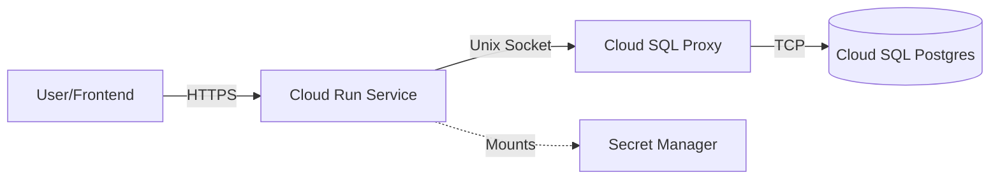

# DevOps Implementation Guide

> [!NOTE]
> **Living Document**: This file is maintained by the DevOps Agent (`devops_qa`). It serves as the source of truth for deployment strategies, configuration details, and lessons learned.

## 1. Deployment Strategy

We use a **Containerized Deployment** on **Google Cloud Platform (GCP)**.

- **Compute**: Google Cloud Run (Fully managed, serverless containers).
- **Database**: Cloud SQL (PostgreSQL).
- **Secrets**: GCP Secret Manager (NO secrets in env vars or git).
- **CI/CD**: Google Cloud Build (triggered via `cloudbuild.yaml`).

### Architecture Diagram


## 2. Configuration Management

### Key Files
- **`cloudbuild.yaml`**: Defines the build steps.
  - **CRITICAL**: Must use `--update-env-vars` instead of `--set-env-vars` to preserve secrets injected at runtime.
- **`deploy.sh`**: Manual deployment script.
  - Usage: `./deploy.sh`
  - Handles build and deploy in one go. Useful for local testing or emergency fixes.
- **`service.yaml`**: Exported configuration of the running service.
  - **WARNING**: Contains `value: "REDACTED"` placeholders. Do NOT apply this file directly without ensuring secrets are handled. It is gitignored.
- **`scripts/migrate_prod.sh`**: Safe wrapper to run database migrations against production.
  - Usage: `./scripts/migrate_prod.sh` (Requires `gcloud` auth).
  - Automatically fetches `DB_PASS` from Secret Manager and uses Cloud SQL Proxy.
- `scripts/verify_gcp.sh`: Automated E2E test suite runner.
- `scripts/deploy_frontend.sh`: Automates frontend build and deployment to Cloud Run.
- `scripts/deploy_backend.sh`: Automates backend build (from source) and deployment to Cloud Run.

### Frontend Deployment
The frontend is a Next.js application containerized using Docker and deployed to Cloud Run.
- **Process**:
    1.  Run `./scripts/deploy_frontend.sh`.
    2.  Use Cloud Build to create the image (Node 20 Alpine).
    3.  Deploy to Cloud Run with `NEXT_PUBLIC_API_URL` set to the production backend.
- **Optimization**: Uses Next.js `standalone` output for minimal image size.
- **URL**: `https://dental-frontend-963321342744.us-central1.run.app`

### Database Connection
Cloud Run connects to Cloud SQL via a **Unix Socket**, not TCP.
- **Host**: `/cloudsql/dentaldb-482716:us-central1:dentaldb`
- **DB Name**: `dental_db` (⚠️ NOT `dental_notes`)
- **User**: `dental_user`
- **Driver**: `postgresql+asyncpg`

### Backend Deployment
The backend is a FastAPI application containerized using a custom `Dockerfile` to ensuring proper dependency management and startup command execution.
- **Process**:
    1.  Run `./scripts/deploy_backend.sh`.
    2.  Builds container via Cloud Build using `backend/Dockerfile`.
    3.  Deploys to Cloud Run service `dental-backend`.
    4.  **Important**: The `Dockerfile` uses `exec uvicorn ...` to correctly handle the `$PORT` environment variable injected by Cloud Run.
- **CORS Configuration**: The `backend/app/main.py` is configured with `allow_origin_regex` to support dynamic preview environments (e.g., Lovable).
    - **Regex**: `r"^https://.*\.lovable(project)?\.(app|com)$"`
    - **Verification**: Use `curl -I -H "Origin: https://preview.lovable.app" ...` to test.

## 3. Secrets Management (Security)

We use a "Zero Vulnerability" approach for secrets.

| Secret Name | Purpose | Storage |
|-------------|---------|---------|
| `DB_PASS` | Database password | GCP Secret Manager |
| `SECRET_KEY` | JWT signing | GCP Secret Manager |
| `ENCRYPTION_KEY` | Field-level encryption | GCP Secret Manager |
| `OPENAI_API_KEY` | LLM API access | GCP Secret Manager |
| `INTERNAL_API_KEY` | Cloud Tasks auth for internal endpoints | GCP Secret Manager |

> [!IMPORTANT]
> **Never** put these values in `service.yaml` or `cloudbuild.yaml`.
> If you need to verify they exist, check the Cloud Run "Variables & Secrets" tab in the Console.

> [!CAUTION]
> **Password Rotation Required**: The `DB_PASS` was previously exposed in plaintext in `DEPLOYMENT_GUIDE.md` git history.
> The password should be rotated in Cloud SQL and Secret Manager.

### Security Hardening (Feb 8 2026)
- `cloudbuild.yaml` now includes `--update-secrets` to bind secrets during CI/CD deploys
- `deploy_backend.sh` switched from `--set-*` to `--update-*` to avoid wiping unmanaged config
- Backend now **fails fast on startup** if `ENCRYPTION_KEY` or `SECRET_KEY` are not set
  - Set `ALLOW_INSECURE_DEFAULTS=true` for local development only
- Internal endpoint (`/internal/generate-summary`) now requires `X-Internal-Key` header
  - TODO: Migrate to OIDC token verification

## 4. Learnings & Gotchas

### Issue 1: Environment Variable Conflicts with Secrets
**Symptom**: Deployment fails with "Cannot update environment variable [SECRET]... because it has already been set with a different type."
**Cause**: The service was originally deployed with `SECRET_KEY` as a plain environment variable. Switching to Secret Manager created a type conflict.
**Fix**: You must explicitly remove the old environment variable while setting the secret:
```bash
gcloud run deploy ... \
  --remove-env-vars SECRET_KEY \
  --set-secrets="SECRET_KEY=SECRET_KEY:latest"
```

### Issue 2: CI/CD Overwriting Secrets
**Symptom**: Secrets disappear after a git push deployment.
**Cause**: `cloudbuild.yaml` used `--set-env-vars` which replaces the *entire* configuration, wiping out secret bindings.
**Fix**: Always use `--update-env-vars`.

### Issue 3: Service Account Permissions
**Gotcha**: The "Compute Engine default service account" is used by Cloud Run by default.
**Requirement**: This account (`[PROJECT_NUMBER]-compute@...`) must have the `Secret Manager Secret Accessor` role to read secrets.

### Issue 4: Database Name Confusion
**Symptom**: Migrations fail with `InvalidCatalogNameError: database "dental_notes" does not exist`.
**Cause**: Local development used `dental_notes`, but the production database was provisioned as `dental_db`.
**Fix**: Ensure `DB_NAME=dental_db` is set in environment variables or migration scripts.

## 5. QA & Verification

Refer to **[QA.md.resolved](file:///Users/albert/.gemini/antigravity/brain/14c814cc-5f50-4553-af82-903f7d03c5e8/QA.md.resolved)** for the detailed verification protocol.

**Primary Verification Tool**:
Run the standardized script to verify deployment health:
```bash
./scripts/verify_gcp.sh
```

### AI Summary Pipeline Test (Feb 2 2026)
The `test_live_api.py` now includes an **AI-GENERATED SUMMARY TEST** section that validates the note → summary pipeline:
1. Creates a test patient and visit
2. Creates a clinical note (triggers summary generation)
3. Polls for AI-generated summary with retry logic
4. Verifies summary source and model metadata

**For local testing**, enable sync mode in `.env`:
```bash
SUMMARY_SYNC_MODE=true
```

**Standalone test** (faster, dedicated):
```bash
python tests/e2e/test_summary_pipeline.py
```

### Quick Health Check
```bash
curl https://dental-backend-963321342744.us-central1.run.app/health
# Expected: {"status":"ok"}
```
